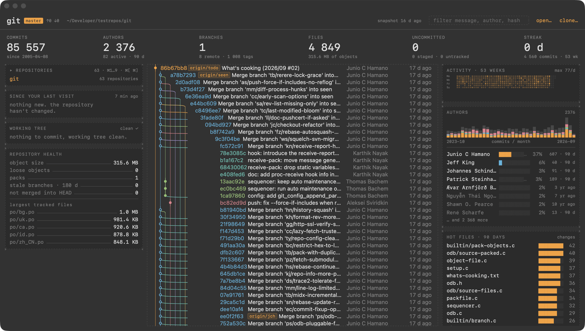

# Lanes

A read-only Git dashboard for macOS, all monospace, that opens from a
memory-mapped snapshot instead of running Git at launch.



## What it shows

- **Repositories**: every repository on the Mac (recent ones, plus the ones
  found under your home folder). Click to switch, or use ⌘1…⌘9, ⌘[ and ⌘].
  Missing snapshots are built in the background so every switch is immediate.
  Click the frame title to collapse it.
- **Commit graph** with lanes, branches, tags and HEAD, virtualized.
- **Since your last visit**: new commits, authors, files touched.
- **Working tree**: modified, staged, untracked.
- **Selected commit**: message, author, date, parents, and the files it
  touched with lines added and removed (no line-by-line diff).
- **Repository health**: object size, loose objects, packs, stale branches,
  branches not merged into HEAD, largest tracked files.
- **Activity** over 53 weeks, authors and their monthly river, hot files,
  where the code lives and who owns it, the code clock.
- Ahead/behind the upstream and the stash count in the header.
- **Clone** (⌘⇧O): a URL, `owner/repo`, or keywords searched on GitHub.
- Open the repository in Finder, your terminal or your editor.

The filter (⌘F) searches messages, authors and hashes. ↑ ↓ move the selection
in the graph, ⎋ clears it.

## How it starts

Lanes never reads Git on the launch path. It memory-maps a binary **snapshot**
built the previous time, draws, then checks in the background whether the
repository changed (a fingerprint of HEAD, refs, the index and status) and
rebuilds if needed. While the window is open, FSEvents triggers the same check.
The module graph enforces it: the `Dashboard` module cannot import the one that
runs `git`.

Measured on git/git (85,557 commits), 13-inch MacBook Pro (Mac14,7, Apple M2, 8 GB RAM, macOS 27.0), 20 launches, snapshot
already built, warm disk cache:

| from process creation to… | median | p90 |
|---|---|---|
| first frame (content from the snapshot) | 480 ms | 523 ms |
| full dashboard (derived stats computed) | 525 ms | 582 ms |

The Mac was not idle during this run (other apps open, 2.4 GB of swap in use);
fastest runs were 412 ms and 452 ms, slowest 866 ms and 914 ms (the first
launch after a rebuild). Earlier figures of "under 400 ms" came from 3 launches
on an idle machine; they do not hold as a median. A colder scenario (disk cache
purged) was not measured: `purge` needs root.

Method: the clock starts at the process creation time read from the kernel
(`sysctl KERN_PROC`, `p_starttime`), so dyld is included but the time between
your click and process creation (LaunchServices, Dock) is not. "First frame" is
marked on the run-loop turn after `makeKeyAndOrderFront`; the window then fades
in over 160 ms. Run it on your machine:

```
Scripts/measure-coldstart.sh 20 ~/path/to/repo
```

The **first** time Lanes opens a repository it has to build the snapshot
(about 2 s for git/git on the machine above); you see progress, not the
dashboard. The numbers above apply from the second launch on.

Details: [docs/ARCHITECTURE.md](docs/ARCHITECTURE.md), decisions:
[docs/DECISIONS.md](docs/DECISIONS.md), build log: [docs/JOURNAL.md](docs/JOURNAL.md)
(in French).

## Install

Download `Lanes-x.y.dmg` from
[Releases](https://github.com/menufactory43/lanes/releases), open it and drag
`Lanes.app` to Applications. The app and the DMG are signed with a Developer ID
and notarized by Apple, so it opens with a double-click. A zip is published
alongside, with `SHA256SUMS.txt`.

Requirements:

- macOS 15 or later.
- **Apple Silicon only.** The binary is arm64; there is no Intel build.
- Git, from Xcode, the Command Line Tools or Homebrew, to build snapshots.

The interface is in English, and in French when macOS is set to French.

## What it does and does not do

- **Read-only.** Lanes only runs `git log`, `for-each-ref`, `rev-parse`,
  `symbolic-ref`, `status --porcelain=v2`, `ls-tree`, `show`,
  `branch --no-merged`, `stash list`, `rev-list --count` and `count-objects`,
  with `GIT_OPTIONAL_LOCKS=0` so that `git status` does not even refresh the
  index. No commit, stage, checkout, merge, rebase, fetch, pull or push. The one
  exception is Clone (⌘⇧O), which runs `git clone` into a new folder; it never
  touches an existing repository.
- **It scans your home folder.** To fill the repository list, Lanes walks your
  home folder four levels deep, at most once a day (skipping hidden folders,
  `Library`, `Applications`, `Movies`, `Music`, `Pictures`, and dependency or
  build folders such as `node_modules`, `.build`, `DerivedData`), stopping at
  200 repositories, then builds
  the missing snapshots in the background, one at a time, with history capped
  at 100,000 commits. File › Find Repositories on This Mac forces a new scan.
  There is no setting to turn this off yet.
- **What it writes**: snapshots in `~/Library/Application Support/Lanes/snapshots`,
  and its preferences (recent repositories, last visits) in the app's defaults.
- **Network**: only the GitHub search in the Clone sheet
  (`api.github.com/search/repositories`, anonymous, once you type three
  characters that are not a URL) and the clone itself. Nothing at launch, no
  telemetry, no update check.
- The app is not sandboxed (hardened runtime, no entitlements).
- Known limits: history truncated at 250,000 commits; lanes beyond 255 drawn on
  the last one; authors merged by name, not e-mail; minimum window size
  1120×680; no auto-update, no Homebrew cask.

## Build from source

Requires Xcode 26 (Swift 6) on macOS 15+.

```
Scripts/build-app.sh             # release build → ~/Applications/Lanes.app
swift test                       # 20 tests in 4 suites: format, layout, extraction, analytics
Scripts/measure-coldstart.sh 20 ~/path/to/repo
```

Command line:

```
open -a Lanes --args ~/path/to/repo   # or ⌘O, or drop a folder on the window
Lanes --build ~/path/to/repo          # build the snapshot from the command line
LANES_MEASURE=1 LANES_AUTOQUIT=1 Lanes.app/Contents/MacOS/Lanes ~/path/to/repo
```

Release (maintainer): `Scripts/release.sh 1.1` builds, signs, notarizes and
produces the zip and DMG; `PUBLISH=0` stops before tagging and creating the
GitHub release.

## En français

Lanes est un tableau de bord Git en lecture seule pour macOS, entièrement
monospace. L'interface s'affiche en français quand macOS est réglé en
français. Le journal de construction et les décisions d'architecture sont en
français dans [docs/](docs/). Site : <https://menufactory43.github.io/lanes/>.

## License

MIT. See [LICENSE](LICENSE).

---

Also by the author: Souffleuse, local AI autocomplete for macOS — https://souffleuse.app/en/
