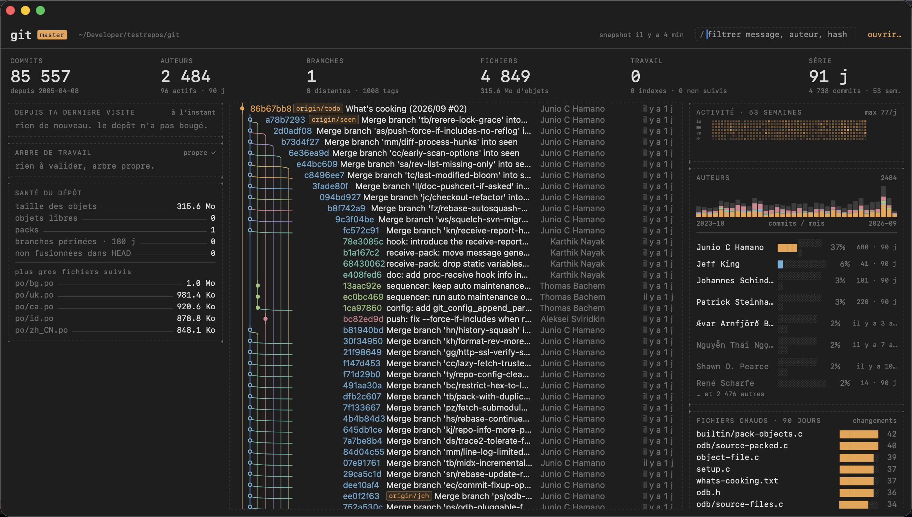

# Lanes

> **English** — Lanes is a read-only, all-monospace Git dashboard for macOS built
> around a launch budget: **the whole dashboard is on screen in under 400 ms from
> a cold start**, before the Dock icon finishes its first bounce, even on a
> repository with 85,000 commits. It never reads Git at launch: it memory-maps a
> binary snapshot built last time, draws, then checks in the background whether
> the repo changed. Download the notarized app from
> [Releases](https://github.com/menufactory43/lanes/releases) or read on in
> French. Requires macOS 15+. MIT.

Tableau de bord Git en lecture seule pour macOS, entièrement monospace, conçu
autour d'un budget de lancement : **tout le tableau de bord est à l'écran en
moins de 400 ms à froid**, avant que l'icône du Dock ait fini son premier
rebond, y compris sur un dépôt de 85 000 commits.



## Ce qu'il montre

- Le cadre « dépôts » : tous les dépôts du Mac (récents + découverts sous ta
  maison), bascule instantanée au clic, ⌘1…⌘9, ⌘[ et ⌘]. Les snapshots
  manquants se construisent en fond pour que chaque bascule soit immédiate.
  Le cadre se replie d'un clic sur son titre.
- Le graphe des commits avec ses voies, branches, tags et HEAD, virtualisé.
- Depuis ta dernière visite : commits, auteurs, fichiers touchés.
- L'arbre de travail : modifié, indexé, non suivi.
- Le détail du commit sélectionné.
- La santé du dépôt : taille, objets libres, branches périmées, plus gros fichiers.
- L'activité sur 53 semaines, les auteurs et leur rivière mensuelle, les fichiers
  chauds, où le code vit et qui le possède, l'horloge du code.

- Les fichiers du commit sélectionné, avec lignes ajoutées et supprimées.
- Ahead/behind par rapport à l'upstream et le nombre de stashes, dans l'en-tête.
- Cloner (⌘⇧O) : URL, `owner/repo`, ou mots-clés cherchés sur GitHub.
- Ouvrir le dépôt dans le Finder, le Terminal ou ton éditeur.

Le filtre (⌘F) cherche dans les messages, auteurs et hashes. ↑ ↓ déplacent la
sélection dans le graphe, ⎋ la retire.

## Comment c'est rapide

L'app ne lit jamais Git au lancement. Elle mappe en mémoire un **snapshot**
binaire construit la fois précédente, dessine, puis vérifie en arrière-plan si
le dépôt a changé (empreinte de HEAD, références, index, statut) et reconstruit
si besoin. Pendant qu'elle est ouverte, FSEvents déclenche la même vérification.

Détails : [docs/ARCHITECTURE.md](docs/ARCHITECTURE.md), décisions :
[docs/DECISIONS.md](docs/DECISIONS.md), journal : [docs/JOURNAL.md](docs/JOURNAL.md).

## Installer

Télécharge `Lanes-x.y.zip` depuis les
[Releases](https://github.com/menufactory43/lanes/releases), décompresse, glisse
`Lanes.app` dans Applications. L'app est signée Developer ID et notarisée par
Apple : elle s'ouvre d'un double-clic. Site : <https://menufactory43.github.io/lanes/>.

## Construire

```
Scripts/build-app.sh            # release → ~/Applications/Lanes.app
swift test                       # 18 tests : format, layout, extraction, analytics
Scripts/measure-coldstart.sh 5 ~/mon/depot
```

Prérequis : macOS 15+, Xcode 26 (Swift 6), `git` (Xcode ou Command Line Tools).

## Utiliser

```
open -a Lanes --args ~/mon/depot   # ou ⌘O, ou glisser un dossier sur la fenêtre
Lanes --build ~/mon/depot          # construit le snapshot en ligne de commande
LANES_MEASURE=1 LANES_AUTOQUIT=1 Lanes.app/Contents/MacOS/Lanes ~/mon/depot
```

Le premier lancement sur un dépôt construit le snapshot (quelques dixièmes de
seconde à quelques secondes selon la taille) ; les suivants sont instantanés.

## Publier

```
Scripts/release.sh 1.0            # build, signature Developer ID, notarisation, zip + dmg, release GitHub
```

## Lecture seule

Lanes n'exécute aucune commande qui modifie un dépôt. `GIT_OPTIONAL_LOCKS=0`
garantit qu'il ne pose même pas de verrou sur l'index.

## Licence

MIT. Voir [LICENSE](LICENSE).
